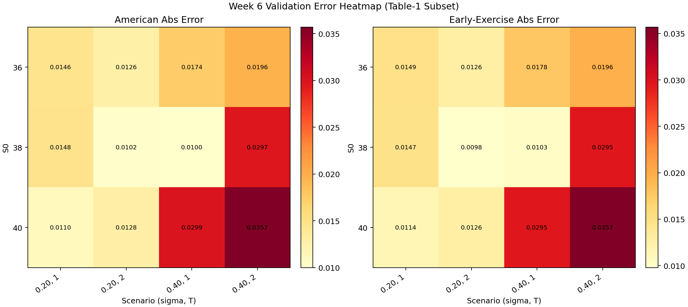

# Week 6 Validation Report

Generated: 2026-04-08 03:07:18 UTC

## Configuration

- Table-1 subset validation: 12 cases
- Paths per case/seed: 30,000
- Seeds: 11, 17, 23
- Exercise grid: 50 dates/year
- Regression basis: constant + first 3 weighted Laguerre terms

## Table-1 Subset Comparison

| S0 | sigma | T | LSM American (mean) | Paper American | Abs Err | LSM Early Ex | Paper Early Ex | Early Ex Abs Err |
|---:|---:|---:|---:|---:|---:|---:|---:|---:|
| 36 | 0.20 | 1 | 4.4574 | 4.4720 | 0.0146 | 0.6131 | 0.6280 | 0.0149 |
| 36 | 0.20 | 2 | 4.8084 | 4.8210 | 0.0126 | 1.0454 | 1.0580 | 0.0126 |
| 36 | 0.40 | 1 | 7.0736 | 7.0910 | 0.0174 | 0.3622 | 0.3800 | 0.0178 |
| 36 | 0.40 | 2 | 8.4684 | 8.4880 | 0.0196 | 0.7684 | 0.7880 | 0.0196 |
| 38 | 0.20 | 1 | 3.2292 | 3.2440 | 0.0148 | 0.3773 | 0.3920 | 0.0147 |
| 38 | 0.20 | 2 | 3.7248 | 3.7350 | 0.0102 | 0.7342 | 0.7440 | 0.0098 |
| 38 | 0.40 | 1 | 6.1290 | 6.1390 | 0.0100 | 0.2947 | 0.3050 | 0.0103 |
| 38 | 0.40 | 2 | 7.6393 | 7.6690 | 0.0297 | 0.6605 | 0.6900 | 0.0295 |
| 40 | 0.20 | 1 | 2.3020 | 2.3130 | 0.0110 | 0.2356 | 0.2470 | 0.0114 |
| 40 | 0.20 | 2 | 2.8662 | 2.8790 | 0.0128 | 0.5104 | 0.5230 | 0.0126 |
| 40 | 0.40 | 1 | 5.2781 | 5.3080 | 0.0299 | 0.2185 | 0.2480 | 0.0295 |
| 40 | 0.40 | 2 | 6.8853 | 6.9210 | 0.0357 | 0.5593 | 0.5950 | 0.0357 |

### Aggregate Error

- Mean absolute error vs paper American values: 0.0182
- Max absolute error vs paper American values: 0.0357
- Mean absolute error vs paper early exercise values: 0.0182

## Normalization Diagnostics

| Mode | Mean Price | Std Across Seeds | Median Cond # | Max Cond # | Rank-Deficient Slices | OK Slices |
|---|---:|---:|---:|---:|---:|---:|
| x = S/K (normalized) | 23.0393 | 0.1618 | 201198.65 | 14855005.34 | 0 | 147 |
| x = S (unnormalized) | 21.1491 | 0.2537 | 112257303954859377486305816816625349985438139169615380480.00 | 1150334485194295354582202228868600221317715786717614560883168320072724178923010654208.00 | 147 | 0 |

## Interpretation

- Table-1 subset errors are in a range consistent with finite Monte Carlo noise at this path count.
- Early exercise premia are directionally consistent with paper results across the tested cases.
- Normalizing state by strike (x = S/K) materially improves numerical conditioning in high-price-scale cases.

## Visual

Quant-style error heatmap by scenario:

